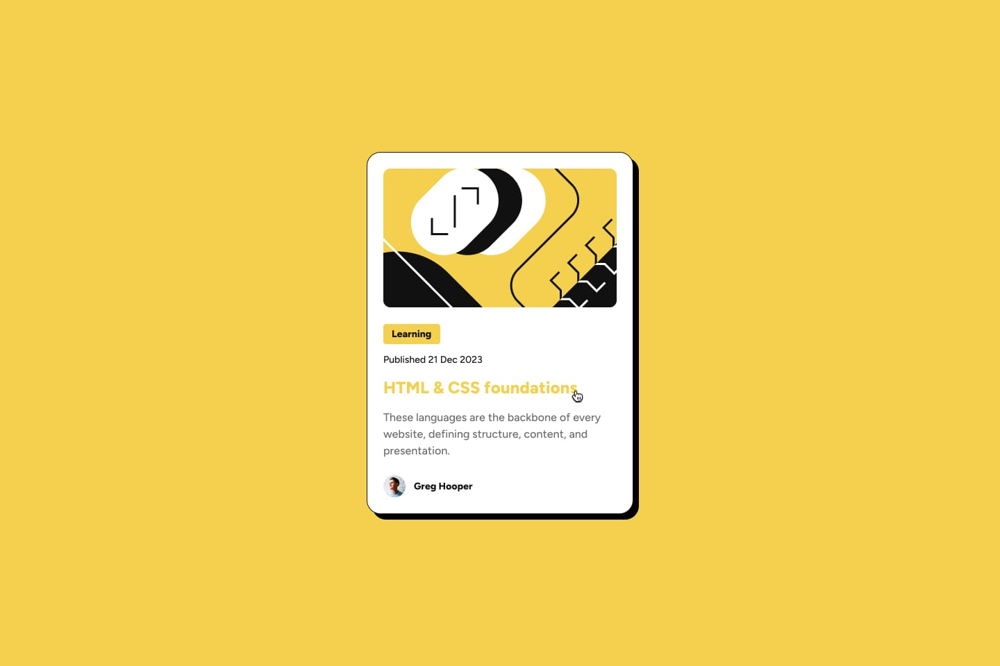

# Frontend Mentor – Blog Preview Card Solution

This is my solution to the **Blog Preview Card** challenge on  [Frontend Mentor](https://www.frontendmentor.io/).  
The challenge helped me improve my HTML and CSS skills by building a responsive card component that closely matches the design.

## Table of Contents
- [Overview](#overview)  
- [The Challenge](#the-challenge)  
- [Design](#design)  
- [Links](#links)  
- [My Process](#my-process)  
- [Built With](#built-with)  
- [What I Learned](#what-i-learned)  

## Overview
This project is a **responsive blog preview card** that adapts to different screen sizes.  
It features a blog image, a “Learning” category tag, a title, a short description, and a footer with the author’s avatar, name, and the publish date.

## The Challenge
Users should be able to:

- View the card layout depending on their device’s screen size.  
- See hover state for interactive element title.  
- Read the blog info clearly thanks to a well-structured and semantic markup.

## Design
### Desktop Design  

### Desktop States  

### Mobile Design  

## Links  
- **Solution URL:** [GitHub Repository](https://github.com/mlopezl/mi-version-de-blog-preview-card-de-frontend-mentor)  
- **Live Site URL:** [Live Demo](https://mlopezl.github.io/mi-version-de-blog-preview-card-de-frontend-mentor/) 

## My Process
1. Structured the HTML using semantic elements (like `<article>`, `<header>`, `<footer>`).  
2. Styled the layout with CSS and used **Flexbox** for alignment.  
3. Implemented hover effect on the title to make it interactive.  
4. Ensured the component is fully responsive by adjusting sizes, margins, and typographic scale.

## Built With
- HTML5  
- CSS3  
- Flexbox  

## What I Learned
- How to convert a design into real HTML + CSS.  
- How to apply hover state for better user experience.  
- How to manage typography, spacing, and alignment in a compact UI component.  
- The importance of semantic HTML for structure and accessibility.

---